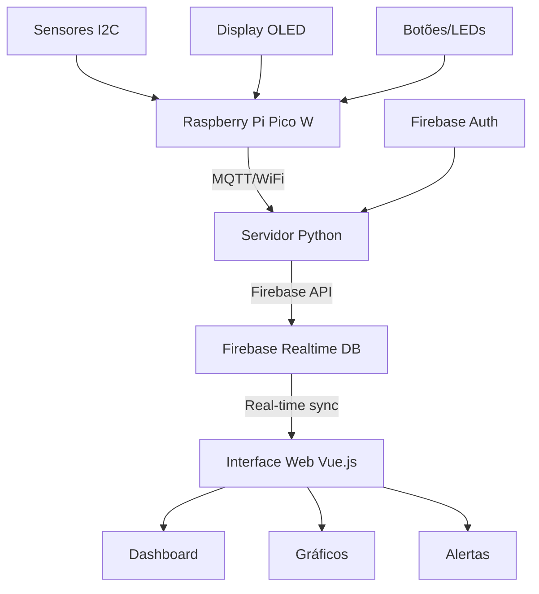

# 🌐 DataLogger IoT - Sistema Completo de Monitoramento
<p><strong>Sistema integrado com Raspberry Pi Pico W, servidor Python e interface web moderna para monitoramento em tempo real.</strong></p>

<div align="center"> 

  <h3>Acesse a plataforma em:</h3>
  <h2><a href="https://embarcatech-datalogger.web.app" target="_blank">🌐 embarcatech-datalogger.web.app</a></h2>
  
</div>

## 🏷️ Tecnologias

<div align="center">


</div>

---

## 📋 Sobre o Projeto

O **DataLogger IoT** é um sistema completo de monitoramento que integra hardware embarcado, servidor de dados e interface web moderna. O projeto coleta dados de sensores através de uma Raspberry Pi Pico W, processa e armazena no Firebase via servidor Python, e apresenta os dados em uma plataforma web responsiva e interativa.

## 🏗️ Arquitetura do Sistema



## 🚀 Funcionalidades

### 🔧 Hardware (Raspberry Pi Pico W)
- **Coleta de dados** de múltiplos sensores I2C
- **Conectividade Wi-Fi** integrada
- **Display OLED** para feedback local
- **Interface de usuário** com botões e LEDs
- **Protocolo MQTT** para transmissão de dados
- **Reconexão automática** em caso de falha

### 🖥️ Servidor Python
- **Cliente MQTT** para recebimento de dados
- **Integração Firebase** com autenticação
- **Processamento de dados** em tempo real
- **Estruturação de dados** para o banco
- **Logs detalhados** de operação

### 🌐 Interface Web
- **Dashboard interativo** com gráficos em tempo real
- **Sistema de autenticação** Firebase
- **Área pública** com dados simulados
- **Área privada** com dados reais dos sensores
- **Alertas configuráveis** por sensor
- **Tabelas com filtros** e exportação de dados
- **Interface responsiva** para desktop e mobile

## 📁 Estrutura do Projeto

```
DataLoggerIOT/
├── 📱 RaspberryPiPicoW/     # Firmware para Raspberry Pi Pico W
│   ├── lib/                 # Bibliotecas de sensores e drivers
│   ├── src/                 # Código fonte principal
│   ├── CMakeLists.txt       # Configuração de build
│   └── requirements.txt     # Instruções de configuração
│
├── 🖥️ Server/              # Servidor Python MQTT/Firebase
│   ├── server.py           # Aplicação principal
│   ├── .env                # Variáveis de ambiente
│   └── requirements.txt    # Dependências Python
│
├── 🌐 Frontend/            # Interface Web Vue.js
│   ├── src/                # Código fonte da aplicação
│   ├── public/             # Arquivos estáticos
│   ├── firebase.json       # Configuração Firebase
│   └── package.json        # Dependências Node.js
│
└── README.md               # Este arquivo
```

## 🔧 Hardware Suportado

### Sensores I2C
- **AHT20** - Temperatura e Umidade
- **BMP280** - Pressão Atmosférica e Altitude
- **MPU6050** - Acelerômetro e Giroscópio

### Periféricos
- **Display OLED SSD1306** (128x64)
- **Botões** para controle local
- **LEDs RGB** para indicação de status
- **Buzzer** para alertas sonoros

### Conectividade
- **Wi-Fi 802.11n** integrado na Pico W
- **Protocolo MQTT** para IoT
- **TLS/SSL** para comunicação segura

## 🚀 Instalação e Configuração

### Pré-requisitos
- **Raspberry Pi Pico W** com sensores conectados
- **Python 3.8+** para o servidor
- **Node.js 18+** para o frontend
- **Conta Firebase** configurada
- **Broker MQTT** (ou usar serviço cloud)

### 1. Configuração do Hardware

```bash
cd RaspberryPiPicoW/
# Siga as instruções em requirements.txt
# Configure suas credenciais em lib/user_data.h
```

### 2. Configuração do Servidor

```bash
cd Server/
pip install -r requirements.txt

# Configure o arquivo .env com suas credenciais:
cp .env.example .env
# Edite .env com suas informações
```

### 3. Configuração do Frontend

```bash
cd Frontend/
npm install

# Para desenvolvimento
npm run dev

# Para produção
npm run build
npm run deploy
```

## 🔐 Configuração de Credenciais

### Hardware (user_data.h)
```c
#define WIFI_SSID "SuaRedeWiFi"
#define WIFI_PASSWORD "SuaSenhaWiFi"
#define MQTT_SERVER "192.168.1.100"
#define MQTT_USERNAME "usuario"
#define MQTT_PASSWORD "senha"
```

### Servidor (.env)
```env
FIREBASE_API_KEY=sua_api_key
FIREBASE_DB_URL=https://seu-projeto.firebaseio.com
EMAIL=seu@email.com
PASSWORD=suasenha
MQTT_BROKER=192.168.1.100
MQTT_USER=usuario
MQTT_PASSWORD=senha
```

## 📊 Fluxo de Dados

1. **Coleta**: Raspberry Pi Pico W lê sensores I2C
2. **Transmissão**: Dados enviados via MQTT/Wi-Fi
3. **Processamento**: Servidor Python recebe e processa
4. **Armazenamento**: Dados salvos no Firebase Realtime DB
5. **Visualização**: Interface web exibe dados em tempo real

## 🔗 Links Úteis

- **🌐 Plataforma Web**: [embarcatech-datalogger.web.app](https://embarcatech-datalogger.web.app)
- **📚 Documentação Pico SDK**: [raspberrypi.org](https://www.raspberrypi.org/documentation/)
- **🔥 Firebase Console**: [console.firebase.google.com](https://console.firebase.google.com)
- **📡 MQTT.org**: [mqtt.org](https://mqtt.org/)

## 🤝 Contribuição

Este projeto foi desenvolvido com o objetivo de proporcionar uma solução completa e didática para o monitoramento de sensores em ambientes IoT, focando em:

- **IoT e Sistemas Embarcados** com microcontroladores
- **Comunicação MQTT** para dispositivos IoT
- **Integração Cloud** com Firebase
- **Desenvolvimento Web Moderno** com Vue 3
- **Visualização de Dados** em tempo real
- **Arquitetura de Microsserviços**

## 📄 Licença

Projeto desenvolvido para fins educacionais no programa EmbarcaTech.

---

<div align="center">
  <p><strong>Desenvolvido com ❤️ por Lucas Gabriel Ferreira</strong></p>
  <p>
    <a href="https://github.com/lgferreiracic">GitHub</a> • 
    <a href="mailto:lucas.gabriel@cepedi.org.br">Email</a>
  </p>
</div>


